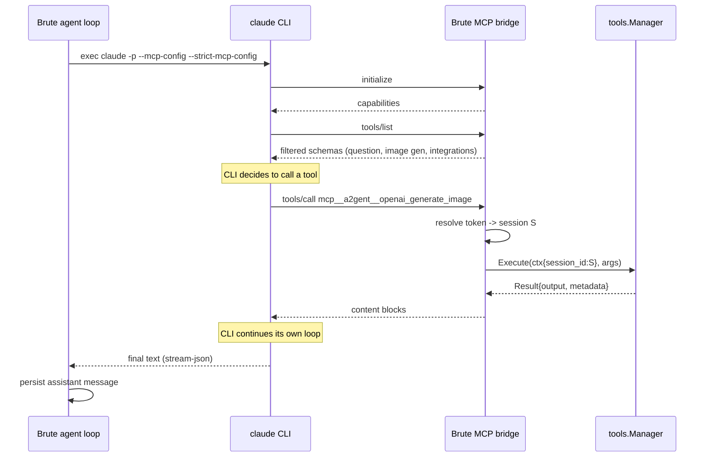
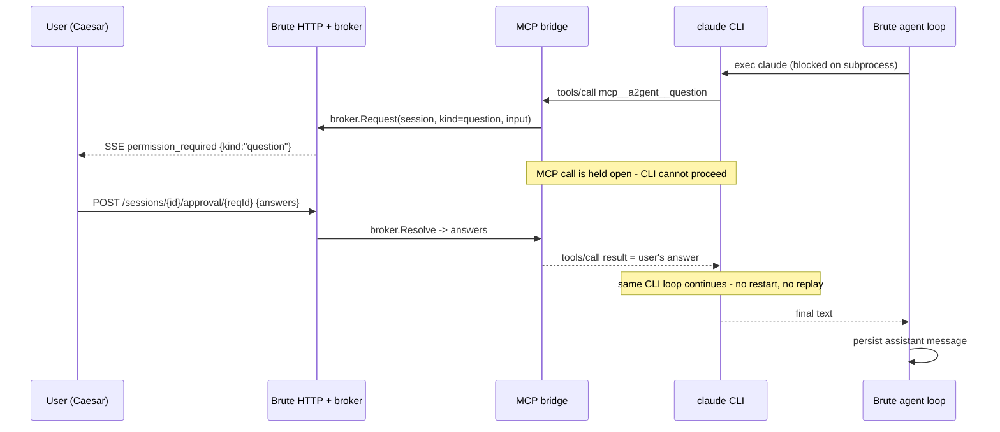

# A2gent Tools over MCP for Claude Code CLI

Design for exposing A2gent's declared tools (`question`, image generation, integrations) to the Anthropic provider while keeping Claude Code CLI as the executor. Verified against **Claude Code CLI 2.1.217**.

## Problem

For the `anthropic` provider Brute does not call the Messages API. `config.IsClaudeProviderRef` routes to `claudecli`, which shells out to the `claude` binary (`internal/http/provider_clients.go:216-220`).

A2gent tool schemas are never sent to the CLI. `claudeToolsArgs` (`internal/llm/claudecli/tools.go:9-47`) only maps a subset of built-in tools onto Claude Code's **native** tools:

| A2gent tool | Native tool granted |
|---|---|
| `bash` | `Bash` |
| `read`, `grep`, `glob`, `find_files`, `filter` | `Glob`, `Grep`, `LS`, `Read` |
| `edit`, `replace_lines`, `insert_lines` | `Edit`, `MultiEdit` |
| `write` | `Write` |

Everything else (`question`, `openai_generate_image`, `leonardo_generate_image`, `jira_query`, `delegate_to_*`, ...) is unreachable. The system prompt prefix reinforces this: *"Do not print JSON tool calls for A2gent to execute"* (`internal/llm/claudecli/client.go:21`).

## Why MCP and not the direct Messages API

Switching `anthropic` to `anthropic.NewClientWithBaseURL` would expose all tools for free (the client already handles `tools`, `tool_use` and `tool_result`), but it changes billing from a flat subscription to metered tokens. See `docs/` cost analysis: measured tool schemas are ~48 KB / ~12k tokens for 45 tools, resent on every loop step, and the direct client has **no `cache_control` support** at all.

MCP keeps the CLI (and therefore the subscription) as the executor while making A2gent tools callable.

## Request path

```
Brute agent loop  (session S)
      │  spawn: claude -p ... --mcp-config <session cfg> --strict-mcp-config
      ▼
Claude Code CLI   (runs its own agent loop, billed to subscription)
      │  MCP tools/call  mcp__a2gent__question
      ▼
Brute MCP server  (session-scoped endpoint, same process)
      │  tools.Manager.Execute(ctx + session_id=S)
      ▼
Brute tool implementation ── result ──► CLI ──► final text ──► Brute agent loop
```

**This is re-entrant.** Brute is both the parent (blocked on the CLI subprocess) and the callee. Every design constraint below follows from that.

### Process and network topology

```
┌─────────────────────────── host ───────────────────────────┐
│                                                            │
│  ┌──────────────────── brute (single process) ──────────┐  │
│  │                                                      │  │
│  │   agent loop ──────► claudecli.Client                │  │
│  │        ▲                    │ os/exec                │  │
│  │        │                    │                        │  │
│  │   tools.Manager             │                        │  │
│  │        ▲                    │                        │  │
│  │        │                    │                        │  │
│  │   MCP bridge handler        │                        │  │
│  │   :{port}/mcp/sessions/{id} │                        │  │
│  │        ▲                    │                        │  │
│  │   approval.Broker           │                        │  │
│  │        ▲                    │                        │  │
│  │   SSE  │  /sessions/{id}/stream                      │  │
│  └────────┼────────────────────┼────────────────────────┘  │
│           │                    ▼                           │
│           │        ┌──── claude CLI (subprocess) ─────┐    │
│           │        │  own agent loop, native tools    │    │
│           │        │  MCP client ─── HTTP 127.0.0.1 ──┼────┘ (back into brute)
│           │        └──────────────────────────────────┘
│           │
│  ┌────────┼──────── Caesar (Tauri / browser) ──────────┐
│  │  ApprovalPanel  ◄── permission_required (SSE)       │
│  │        └──────► POST /sessions/{id}/approval/{req}  │
│  └─────────────────────────────────────────────────────┘
└────────────────────────────────────────────────────────────┘

                      ═══► Anthropic API (subscription auth, CLI-owned)
```

Two things to notice:

1. The MCP client and the MCP server live on **opposite sides of a process boundary but inside the same host**, and the arrow points back into the process that spawned the CLI.
2. Caesar never talks to the CLI. It only talks to Brute, exactly as it does today.

### Sequence: plain tool call (no user interaction)



The CLI blocks on `tools/call` the same way it blocks on its native tools. Nothing special is needed as long as the tool returns in reasonable time.

## Transport: HTTP, not stdio

| Option | Assessment |
|---|---|
| **HTTP (chosen)** | CLI connects back to Brute's existing HTTP server. `tools.Manager` is already in-process with its `store`, `sessionManager`, `speechClips` and approval broker. No extra process, no state duplication. |
| stdio | CLI spawns a helper process. That helper cannot own `tools.Manager` (SQLite locking, in-memory brokers), so it would proxy back to Brute over HTTP anyway. Pure overhead. |

Brute already implements the MCP **client** side for both transports (`internal/http/mcp_server_testing.go`), so the JSON-RPC framing logic is available for reference. This work adds the **server** side.

## Session binding

`tools.Manager.Execute` receives `session_id` through the context (`internal/agent/loop.go:29`). Tools depend on it: `question` fails outright without it (`internal/tools/question.go:169-171`).

An MCP request arriving over HTTP has no such context. Bind it in the URL and mint a token per CLI invocation:

```
POST /mcp/sessions/{sessionID}?token={oneTimeToken}
```

`claudecli` generates the token when building args, registers it in an in-memory map with the session ID and the CLI process lifetime, and revokes it when the subprocess exits. The MCP handler resolves `sessionID`, rebuilds the context with `session_id`, and calls the same `toolManagerForSession(sess)` that the native path uses (`internal/http/toolmanager.go:65`).

### Token lifecycle

```
brute: build CLI args
   │
   ├─ mint token T ── register{T → session S, expires: process lifetime}
   │
   ├─ exec claude --mcp-config {url: .../mcp/sessions/S, bearer: T}
   │        │
   │        ├─ tools/call  ──► verify T → S  ──► Execute(ctx{session_id:S})
   │        ├─ tools/call  ──► verify T → S  ──► Execute(...)
   │        │
   │        └─ process exits
   │
   └─ revoke T  ── any later request with T → 401
```

Rules that fall out of this:

- One token per **CLI invocation**, not per session. A session that runs the CLI twice gets two tokens.
- A token authorizes exactly one `sessionID`; a mismatch between the URL path and the token binding is rejected.
- Revocation on subprocess exit closes the window where a leaked token stays useful.
- Pending blocked calls (a held `question`) must be cancelled when the token is revoked, otherwise the broker leaks a goroutine waiting for an answer nobody will deliver.

## Blocking semantics: the `question` problem

**`question` is non-blocking today.** It writes a pending question, sets session status to `input_required`, and returns immediately (`internal/tools/question.go:174-185`). The pause is implemented by Brute's own loop noticing the status (`internal/agent/loop.go:284`), and the answer restarts the run through `resumeSessionAfterQuestionAnswer` (`internal/http/handlers_session_interactions.go:145`), which builds a **brand new agent run**.

Over MCP none of that works:

- The CLI owns the iteration. It would receive `"Awaiting user response..."` and simply continue, because nothing tells it to stop.
- Worse, if the answer still triggered `resumeSessionAfterQuestionAnswer`, Brute would start a **second parallel run on a session whose CLI subprocess is still alive**.

### Native path vs MCP path

```
NATIVE (openai, gemini, direct anthropic)      MCP BRIDGE (claude CLI)
──────────────────────────────────────────     ──────────────────────────────────
loop step N                                    brute blocked on CLI subprocess
  └─ question tool → status=input_required        └─ CLI blocked on tools/call
  └─ tool returns immediately                     └─ MCP handler blocked on broker
  └─ LOOP EXITS                                   └─ (nothing exits)
        ⋮ user answers                                  ⋮ user answers
  └─ resumeSessionAfterQuestionAnswer            └─ broker resolves
  └─ NEW agent run, replays history              └─ tools/call RETURNS the answer
                                                 └─ same CLI loop continues
```

Left side: stop and restart. Right side: block and continue. They are different mechanisms and must not share the resume code path.

### Sequence: `question` over the MCP bridge



### Handler behavior by tool class

| Tool class | MCP handler behavior |
|---|---|
| `question` | Register with `approval.Broker`, emit SSE `permission_required` with `kind: "question"`, block until Caesar resolves or timeout. Return the answer as the tool result. |
| Long-running (image gen, browser) | Execute synchronously; rely on the MCP client timeout. `tools.ReportProgress` still reaches the session stream. |
| Everything else | Direct synchronous `Execute`. |

`QuestionTool` itself is **not modified**, so the native path keeps its current stop-and-restart semantics. The bridge intercepts `question` before `tools.Manager.Execute` and runs the broker round-trip instead.

### Required fork in `handleAnswerQuestion`

`POST /sessions/{id}/answer` currently always calls `resumeSessionAfterQuestionAnswer`. If a session has a **live MCP-held question**, that would spawn a duplicate run. Guard it:

```
handleAnswerQuestion(sessionID, answer):
    if bridge.HasPendingQuestion(sessionID):
        bridge.Resolve(sessionID, answer)   // unblocks the MCP call
        return                              // MUST NOT resume
    // existing behavior
    sessionManager.AnswerQuestion(...)
    resumeSessionAfterQuestionAnswer(...)
```

This is the single most important backend change, and the one most likely to cause a hard-to-debug duplicate-run bug if missed.

## Caesar integration

**Caesar needs no changes for phase 1.** The blocking question UI already exists, built for the Claude Agent SDK sidecar (`docs/claude-native-tool-permissions.md`), and it is reusable as-is.

### What already exists

| Piece | Location | Status |
|---|---|---|
| SSE `permission_required` / `permission_resolved` handling | `src/pages/chat/hooks/useChatStreaming.ts:187-199` | ready |
| Approval API client | `src/api/approval.ts` (`getSessionApproval`, `submitSessionApproval`) | ready |
| Approval type with question support | `src/api/types/sessions.ts:147-159` — `kind: 'tool' \| 'question'`, `questions?: PendingQuestion[]` | ready |
| Question rendering: options, multiple, custom, image/audio previews | `src/components/chat/ApprovalPanel.tsx` | ready |
| Non-blocking question flow (native path) | `src/pages/chat/hooks/usePendingQuestionRuntime.ts` | unchanged |

### Why it fits without modification

`ApprovalPanel` builds its question from `approval.input` via `questionSelectionsForApproval` (`ApprovalPanel.tsx:31-68`). The fields it reads are exactly the `QuestionTool` schema (`internal/tools/question.go:65-110`):

| `QuestionTool` schema | Read by ApprovalPanel |
|---|---|
| `question` | yes |
| `header` | yes (defaults to `"Question"`) |
| `options[].label` | yes (required) |
| `options[].description` | yes |
| `options[].image_url`, `options[].audio_url` | yes, via `parseQuestionOptionMediaFields` |
| `multiple` | yes |
| `custom` | yes |

So the bridge can pass the raw `question` tool arguments straight through as `approval.input` with `kind: "question"`, and Caesar renders it correctly with no frontend work.

### Two UI flows coexist

```
                 ┌── native providers ──────────────────────────────┐
                 │  SSE input_required                              │
   session   ────┤  usePendingQuestionRuntime → getPendingQuestion  │
   question      │  composer answer → POST /sessions/{id}/answer    │
                 │  → resume: NEW agent run                         │
                 └──────────────────────────────────────────────────┘

                 ┌── claude CLI via MCP bridge ─────────────────────┐
                 │  SSE permission_required {kind:"question"}       │
                 │  ApprovalPanel → POST .../approval/{reqId}       │
                 │  → broker resolves, MCP call returns             │
                 │  → SAME CLI run continues                        │
                 └──────────────────────────────────────────────────┘
```

The user sees a question panel either way. The difference is invisible to them and, importantly, invisible to Caesar's code.

### When Caesar changes would become necessary

| Trigger | Change needed |
|---|---|
| Distinguish A2gent tools from native Claude tools in the approval panel | Add a `source` field to `NativeToolApproval`, render a badge |
| Streaming progress for long MCP tools (image generation) | Consume `tool_progress` for MCP-originated calls; the handler already exists at `useChatStreaming.ts:155` |
| Show which tools the bridge exposed for a run | New settings surface; currently only `A2GENT_DISABLED_TOOLS` is exposed |
| Reuse `input_required` instead of the approval channel | Would require Caesar to know it must not clear state on answer; **this is the reason the approval channel is preferred** |

The last row is the design decision: routing MCP questions through `input_required` would force Caesar to handle two different post-answer behaviors on the same event, because in the MCP case the session status must not flip back through a new run. Using the approval channel keeps the two flows cleanly separated in both Brute and Caesar.

## Tool surface

Do **not** expose all ~60 tools. Reasons: token cost in the CLI's own context, and duplication of native tools it already has.

| Category | Expose | Rationale |
|---|---|---|
| File/exec (`read`, `write`, `edit`, `bash`, `grep`, ...) | **No** | CLI has better native equivalents; keep the existing `claudeToolsArgs` mapping |
| Interactive (`question`) | **Yes** | No native equivalent that routes to Caesar |
| Image generation (`openai_generate_image`, `leonardo_*`, `comfyui_*`) | **Yes** | No native equivalent |
| Integrations (`jira_query`, `appsignal_query`, `circleci_query`, search tools) | **Yes** | No native equivalent |
| Widgets (`suggest_session`, `suggest_git_commit`, `session_task_progress`) | **Yes** | Produce Caesar-rendered blocks |
| Delegation (`delegate_to_subagent`, `delegate_to_agent`, `parallel`, `pipeline`) | **No (phase 1)** | Re-entrancy risk: a delegated child could spawn another CLI that calls back again. Revisit with a depth guard. |
| MCP meta (`mcp_call`, `mcp_list_tools`) | **No** | Recursive MCP-through-MCP |

Selection reuses the existing disabled-tools machinery (`A2GENT_DISABLED_TOOLS`, `resolveDisabledToolNames`) plus an MCP-specific allowlist.

## Naming and allowlist

Claude Code namespaces MCP tools as `mcp__<server>__<tool>`. With server name `a2gent`:

```
mcp__a2gent__question
mcp__a2gent__openai_generate_image
```

Wildcards are supported in `--allowedTools` (`mcp__a2gent__.*`). Note `tools.normalizeToolName` (`internal/tools/manager.go:210-219`) already strips a dotted prefix; the `mcp__` prefix uses underscores and needs explicit stripping.

CLI flags to add in `appendCommonArgs` (`internal/llm/claudecli/client.go:309-341`):

```
--mcp-config <path-or-inline-json>
--strict-mcp-config          # ignore user's own MCP servers, keep runs reproducible
--allowedTools ...,mcp__a2gent__.*
```

`--strict-mcp-config` matters: without it the developer's personal MCP servers leak into agent runs.

## Security

Brute's HTTP server binds `0.0.0.0` with no authentication (`internal/http/server_core.go:174`). An unauthenticated MCP endpoint there would expose the full tool surface, including `bash`, to the network.

Required:

- Bind the MCP endpoint to loopback, or reject non-loopback peers.
- Per-invocation token, single session, revoked when the CLI subprocess exits.
- Do not write the token into a config file inside the work dir (it would land in the repo). Pass inline JSON to `--mcp-config` or use a `0600` file in a temp dir removed on exit.
- Same disabled-tools policy as the native path; MCP must never be a bypass.

## Cost note

Exposed MCP tool schemas are injected into the **CLI's** context and count against subscription usage windows, not against a token bill. Keeping the exposed set small still matters for context budget and latency, but it does not create metered spend the way the direct API path does.

## Configuration

```bash
# Enable the bridge (default: off)
export A2GENT_CLAUDE_MCP_BRIDGE_ENABLED=true

# Optional: override the exposed allowlist (comma-separated)
export A2GENT_CLAUDE_MCP_BRIDGE_TOOLS=question,openai_generate_image,jira_query

# Optional: blocking-tool wait timeout (Go duration, default 5m)
export A2GENT_CLAUDE_MCP_BRIDGE_TIMEOUT=5m
```

Generated MCP config passed to the CLI:

```json
{
  "mcpServers": {
    "a2gent": {
      "type": "http",
      "url": "http://127.0.0.1:{port}/mcp/sessions/{sessionID}",
      "headers": { "Authorization": "Bearer {oneTimeToken}" }
    }
  }
}
```

## Implementation plan

| Step | Touchpoints | Side |
|---|---|---|
| 1. MCP server: `initialize`, `tools/list`, `tools/call` | new `internal/http/mcp_bridge.go` | brute |
| 2. Session token registry, lifetime tied to the CLI process | `internal/http/mcp_bridge.go`, `internal/llm/claudecli/client.go` | brute |
| 3. Schema exposure filtered by allowlist | reuse `tools.Manager.GetDefinitions` + `resolveDisabledToolNames` | brute |
| 4. Blocking `question` via `approval.Broker`, `kind: "question"` | `internal/http/mcp_bridge.go`, `internal/approval` | brute |
| 5. **Fork `handleAnswerQuestion` to skip resume when a bridge question is live** | `internal/http/handlers_session_interactions.go:82-105` | brute |
| 6. CLI args: `--mcp-config`, `--strict-mcp-config`, allowlist | `appendCommonArgs`, `claudeToolsArgs` (`internal/llm/claudecli/tools.go`) | brute |
| 7. Feature flag + loopback guard | `internal/http/toolmanager.go`, `server_core.go` | brute |
| 8. Approval panel, SSE handling, question rendering | none | **Caesar: no change** |

Ship behind `A2GENT_CLAUDE_MCP_BRIDGE_ENABLED`, default off, so the current claudecli path stays untouched until the bridge is proven.

## Tests

```bash
# MCP bridge handlers: initialize / tools/list / tools/call, token scoping
go test ./internal/http/... -run MCPBridge

# Blocking question broker: resolve, timeout, cancel
go test ./internal/http/... -run MCPBridgeQuestion

# Answer endpoint must not spawn a duplicate run while a bridge question is live
go test ./internal/http/... -run AnswerQuestionBridge

# CLI arg construction: --mcp-config, --strict-mcp-config, allowlist
go test ./internal/llm/claudecli/... -run MCP

# Full suite
just test
```

Critical paths to cover (per project TDD policy):

- token scoping rejects a foreign `sessionID`, and a revoked token returns 401
- disabled tools are absent from `tools/list`
- `question` blocks and returns the user's answer as the tool result
- timeout returns an error result rather than hanging the CLI
- answering a bridge-held question does **not** call `resumeSessionAfterQuestionAnswer`
- revoking a token cancels pending blocked calls (no leaked goroutines)

Caesar needs no new tests for phase 1; `ApprovalPanel.test.tsx` already covers question rendering and answer submission.

## Open questions

1. **Streaming.** MCP `tools/call` is request/response. Progress from `tools.ReportProgress` reaches the Caesar session stream, but the CLI sees nothing until the call returns. Acceptable for phase 1; revisit if image generation latency is a problem.
2. **Sidecar interaction.** When `AAGENT_CLAUDE_AGENT_SDK_SIDECAR_PATH` is set, every tool call already routes through the approval broker. An MCP `question` would then produce **two** broker entries: one from the sidecar asking permission to call `mcp__a2gent__question`, and one from the bridge asking the question itself. Decide whether bridge-exposed tools are auto-allowed at the sidecar layer (recommended) or genuinely need a permission prompt of their own.
3. **Delegation re-entrancy.** Exposing `delegate_to_subagent` lets a CLI run spawn another CLI run. Needs a depth counter in session metadata before enabling.
4. **Provider sessions.** `--resume` restores a CLI session whose MCP token has already been revoked. The bridge must mint a fresh token per invocation and the CLI must re-read `--mcp-config` on resume; verify this holds.
